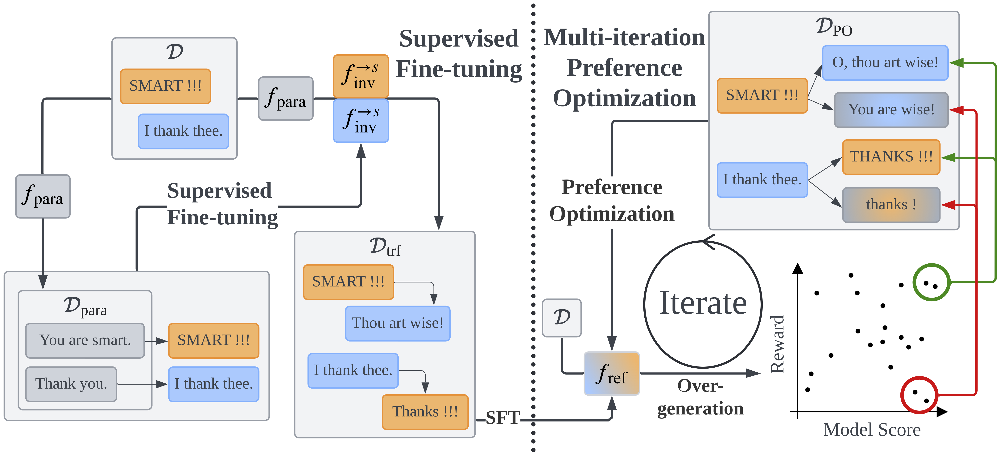

# Style Transfer with Multi-iteration Preference Optimization
The official repository for the paper "[Style Transfer with Multi-iteration Preference Optimization](https://arxiv.org/pdf/2406.11581v1)".  



# Installation

Commends for enviroment setup with conda.
```bash
conda create --name stamp python=3.8.18
conda activate stamp
pip install -U pip
pip install -r requirements.txt
```

# Data
Please download the filtered ParaNMT dataset (paranmt_filtered) and Corpus of Diverse Styles (CDS) from [here](https://github.com/martiansideofthemoon/style-transfer-paraphrase) and download Grammarly's Yahoo Answers Formality Corpus (GYAFC) from [here](https://github.com/raosudha89/GYAFC-corpus).
Please put the contents in the downloaded datasets (not the root folders of the datasets) in `data/paranmt`, `data/cds/original`, and `data/gyafc/original`.

# Reproduce Results

The results in the paper can be reproduced using the scripts in `scripts`.
Please run all scripts from the the root directory.

### Train paraphraser

To train the paraphraser $f_\text{ref}$ used for all experiments, please run the scripts in `scripts/paranmt` in the following order.  

0. `00_process_data.sh`: pre-process the ParaNMT data
1. `01_train_paraphraser.sh`: train the paraphraser $f_\text{para}$

### Train transfer model

To train the style transfer models for CDS and GYAFC, please run the scripts in `scripts/cds` and `scripts/gyafc` in the following order.

0. `00_sample_and_process_data.sh`: sample and pre-process the data from the original dataset to obtain $\mathcal{D}$
1. `01_train_classifier.sh`: train the style classifier $f_\text{cls}$
2. `02_generate_pseudo_parallel_data.sh`: paraphrase $\mathcal{D}$ to obtain $\mathcal{D}_\text{para}$ and the inverse paraphrase dataset
3. `03_train_transfer.sh`: train the inverse paraphrase model $f^{\rightarrow s}_\text{inv}$ for each style on the inverse paraphrase dataset
4. `04_generate_sft_data.sh`: generate the end-to-end style transfer dataset $\mathcal{D}_\text{trf}$
5. `05_train_sft.sh`: train the initial reference model $f^1_\text{ref}$ on $\mathcal{D}_\text{trf}$
6. `06_cpo.sh`: train $f^1_\text{ref}$ using multi-iteration CPO (this script also generate outputs on the test set in `outputs`)